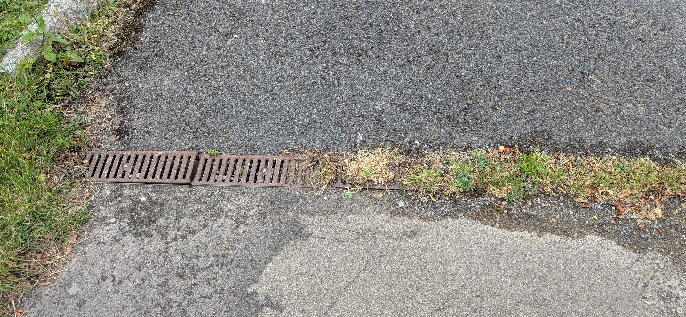
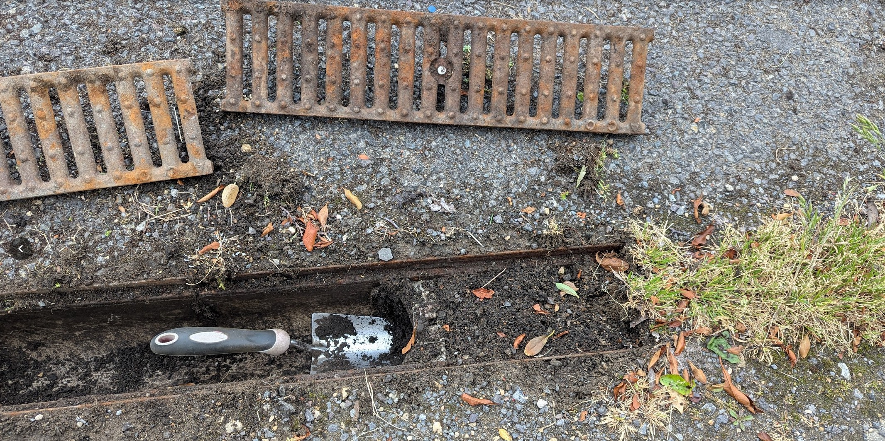
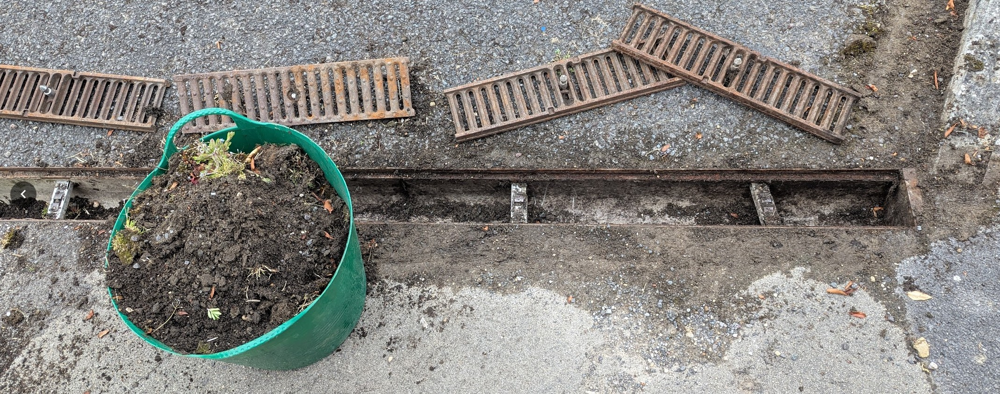
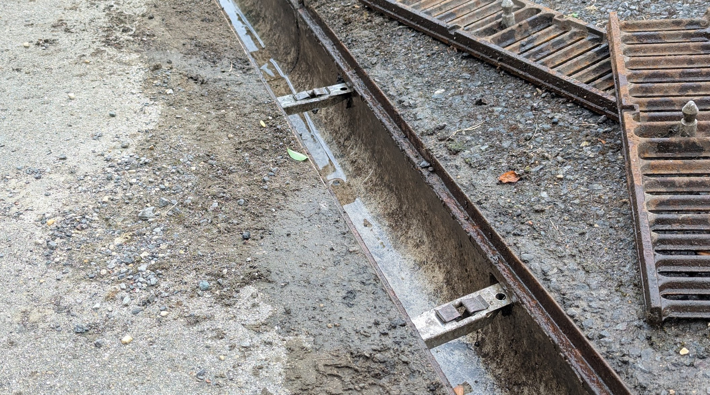

We noticed this unloved drain across a footpath in the village. It's a channel drain, often referred to as an ACO drain, and you'll find them all over the place. Drainage like this is designed to take rainwater off the surface and away underground. Without these channel drains, when it rains there would be puddles and little rivers everywhere.

Rather than attempt to determine who is responsible for not maintaining this, we felt we could clear it ourselves.

> [!TIP] Try to stay in everyone's good books! It's worth telling immediate neighbours or even the Parish Council that you're going to do this work.

You see the metal covers? These ones can be levered off with a crowbar (a screwdriver isn't long enough). It's important to check before you start because some types are bolted down and need a special tool. Do some internet research if you're not sure.

With the covers off, it's simple to clear out the years of accumulated soil. There might also be a trap, a small pit, where there's even more soil. Clear that too.

It's clear now. It took less than an hour to do this safely. Next time it rains, it'll do the job it's supposed to do.

> [!TIP] Safety considerations:
> 1. Do this with another volunteer eg. a neighbour.
> 2. Don't leave a trip hazard for others.
> 3. Don't use unecessary force removing the covers.
> 4. Take the soil away.
> 5. Replace the covers correctly - they need to lie flush with the surface.
