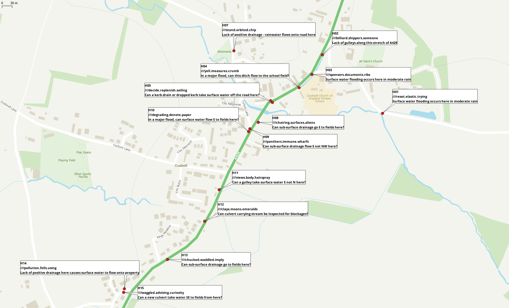
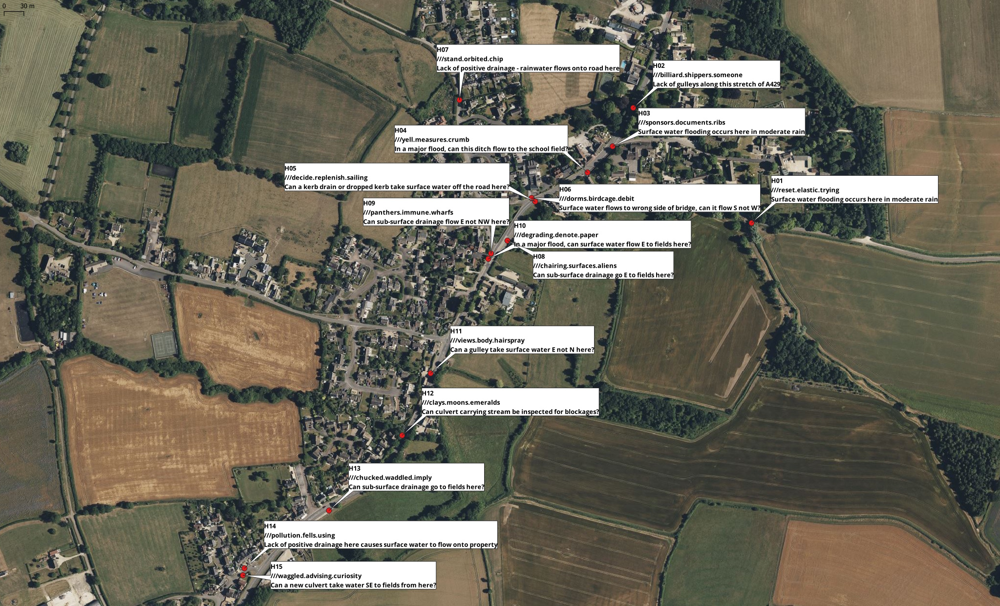

During the flooding of Storm Bert, we saw how our drainage infrastructure was overwhelmed, and how water flowed along our roads resulting in flooding in some homes in the village.

We listened to residents, and walked around the parish spotting opportunities to improve the highways drainage, which we have now taken Wiltshire Council to seek simple improvements.

- we know that local government funding for large infrastructure projects was extremely unlikely.
- we focused on small changes, like missing road gulleys.
- we framed many opportunities as questions:
    - can this culvert be inspected?
    - is a gulley missing here?
    - can the pipes under the road go to the fields, not towards homes?
- we used [what3words](https://what3words.com) so that the Council's highways team can find the correct place.

## The Improvements List

This is the master spreadsheet, embedded from Google Sheets.
<iframe width="100%" height="800" src="https://docs.google.com/spreadsheets/d/e/2PACX-1vT3nlMQEtDvY-wTIZC0BjLsl8TiJntPhv-mGbo8yUMdFHb7epWMgeMyS55IuqUcadrt10RENoOiNR0s/pubhtml?gid=0&single=true"></iframe>

## Map showing locations

## Timeline

In July 2025 the Parish Council arranged a visit by the Principal Drainage Engineer from Wiltshire Council, inviting Crudwell FLAG to attend the meeting.
The FLAG followed up by sending a spreadsheet of suggestions, with locations and a map.
The FLAG attends the [North Wiltshire Operational Flood Working Group](https://www.wiltshire.gov.uk/operational-flood-working-groups) on behalf of the Parish, and each time we ask how we can get progress on this.

## Free Template

Here is a template you can use for your own community. Download it in [.ods](https://docs.google.com/spreadsheets/d/e/2PACX-1vQCEFz7UIoey5H2HfETimq7cXv4iulmJJDetkqbBqOhsc9wRq9LXgZqPSyvflyC76MaaqyLG97t5r-2/pub?output=ods) or [.xlsx](https://docs.google.com/spreadsheets/d/e/2PACX-1vQCEFz7UIoey5H2HfETimq7cXv4iulmJJDetkqbBqOhsc9wRq9LXgZqPSyvflyC76MaaqyLG97t5r-2/pub?output=xlsx) format.
