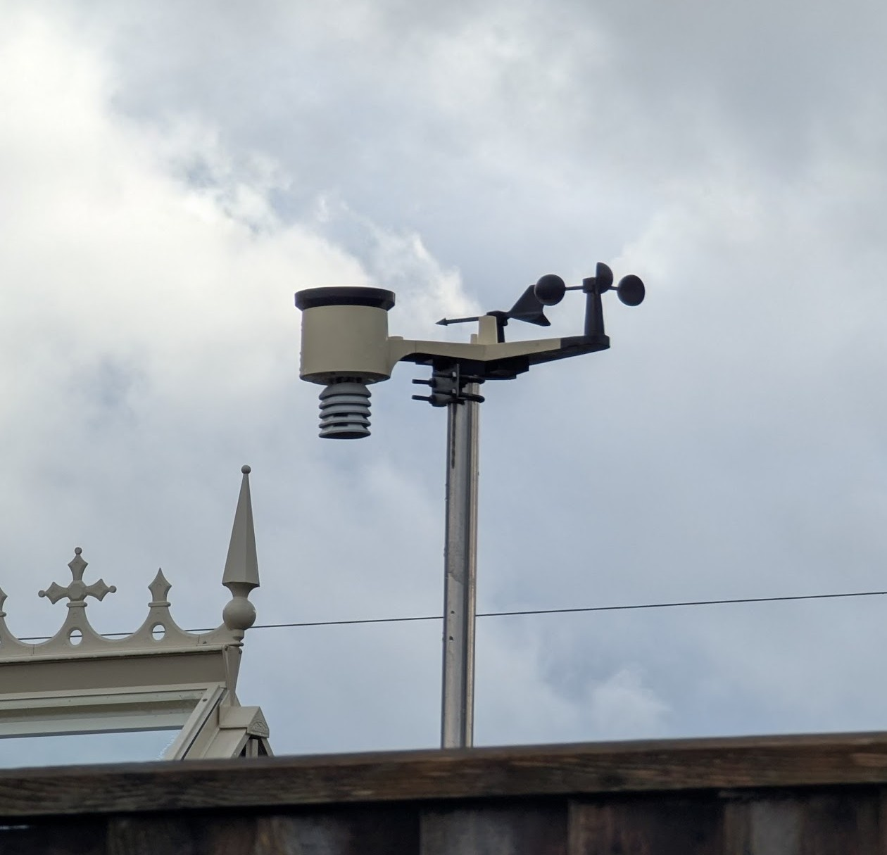
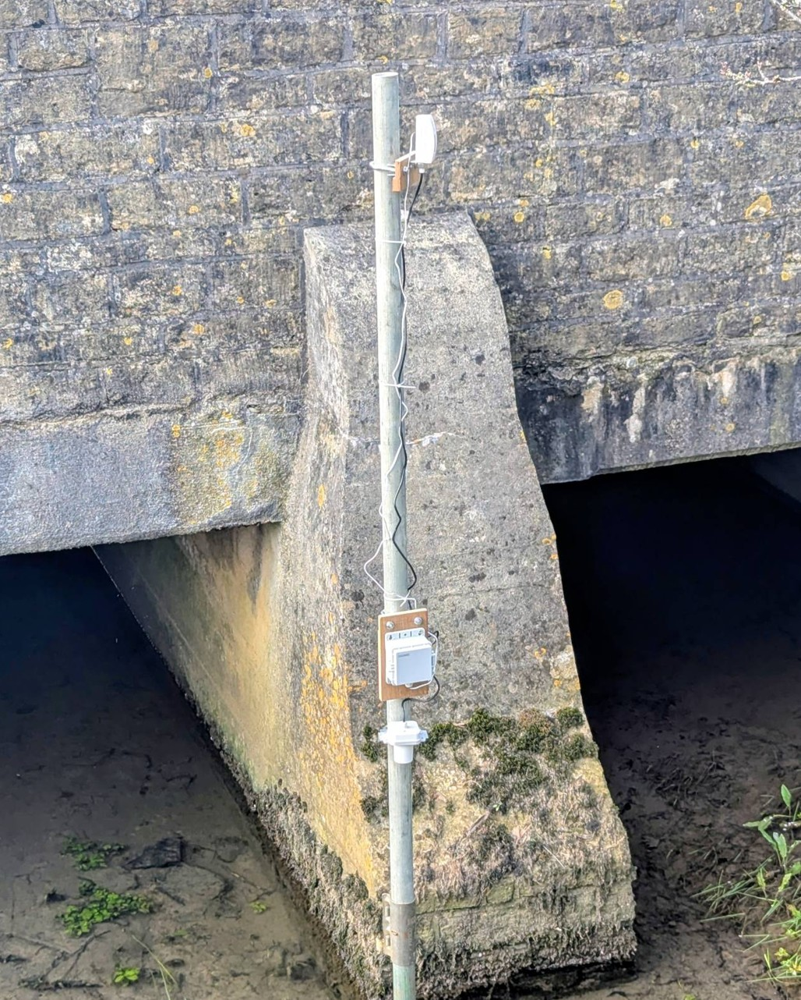
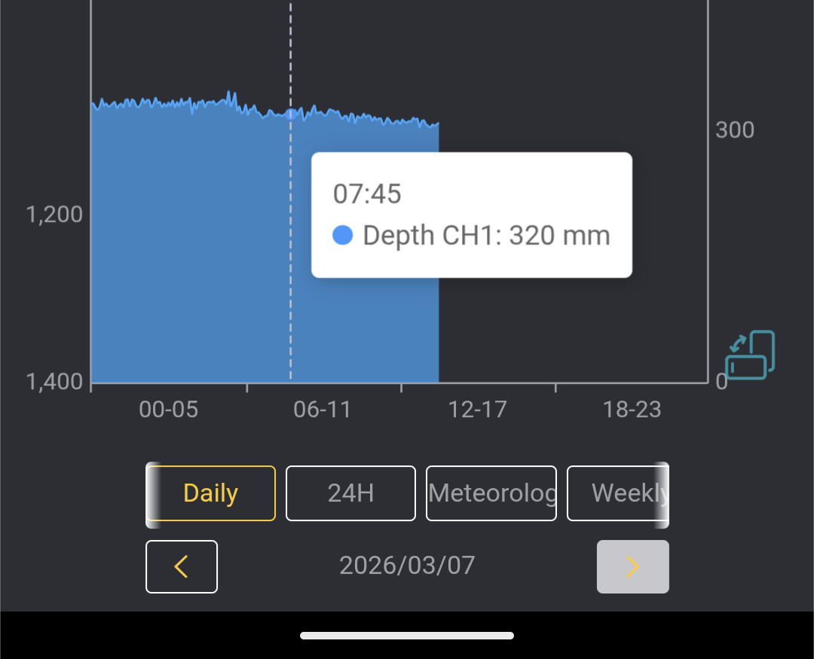

In Crudwell, several residents have setup home weather stations. The longest running is [IMALME1](https://www.wunderground.com/weather/gb/malmesbury/IMALME1) which is located at the south end of the village. On the day of the Storm Bert floods, IMALME1 measured 65mm of rainfall.

We think having a local weather station like [IMALME1](https://www.wunderground.com/weather/gb/malmesbury/IMALME1) improves flood preparedness, because all residents can easily access and see local weather data at any time of the day or night.

### What type of Personal Weather Station is it?

[IMALME1](https://www.wunderground.com/weather/gb/malmesbury/IMALME1) is an [Ecowitt](https://shop.ecowitt.com/en-gb) weather station, and Ecowitt have a number of products including additional sensors which upload data to the cloud and can be displayed on their website or in their free to download smartphone App for [Android](https://play.google.com/store/apps/details?id=com.ost.ecowitt&hl=en-US)/[Apple](https://apps.apple.com/gb/app/ecowitt/id1576152334).

The bit that measures rainfall is self-empting, the owner doesn't have to check a gauge each day. The approximate cost of a weather station like this is £100.

### How can it monitor the river level?

Ecowitt also sells additional sensors, including [a laser distance sensor](https://shop.ecowitt.com/en-gb/products/lds01?variant=45041611899042) that would typically be used for measuring snowfall or measuring a water tank. One of Crudwell's residents has successfully tried one out measuring the depth of the river. To do this he:
- bought the weather station with the optional Internet of Things (IoT) Gateway
- bought and mounted the battery-powered laser sensor above the river, ensuring line of sight back to the weather station.

The main issue is how to mount the laser pointing straight down at the surface of the water. Some straightforward calibration is also required. The results speak for themselves, because the depth of the river is now displayed in real-time in the weather app alongside wind and rain!

This is a huge step forward for our community. A year ago, we didn't know the depth of the river nor the depth of the floods. Now, with a bit of ingenuity and off-the-shelf technology, we have a second weather station and know the depth of our main watercourse at any time of the day or night. We think that this complements the national [EA Flood Alerts](https://check-for-flooding.service.gov.uk/alerts-and-warnings) service, by giving our community more accuracy and confidence in the run-up to a possible flood.

### How did you mount it above the river?

We currently have the laser sensor on a scaffolding pole, and are keeping a close eye on this temporary installation. We think this is a compromise, and might not to be suitable in the long term for a number of reasons. Please [e-mail us](mailto@crudwellflag@gmail.com) if you have ideas about how to mount a downward-facing sensor without being in the river bed nor in the flow of water.

### Where can I read more detail?

<a href="Crudwell FLAG River level monitoring - Ecowitt solution V1.pdf">Click here</a> for instructions about what to buy and how to get it working. The approximate cost is £150-300 depending on whether you have the Ecowitt weather station or not.
