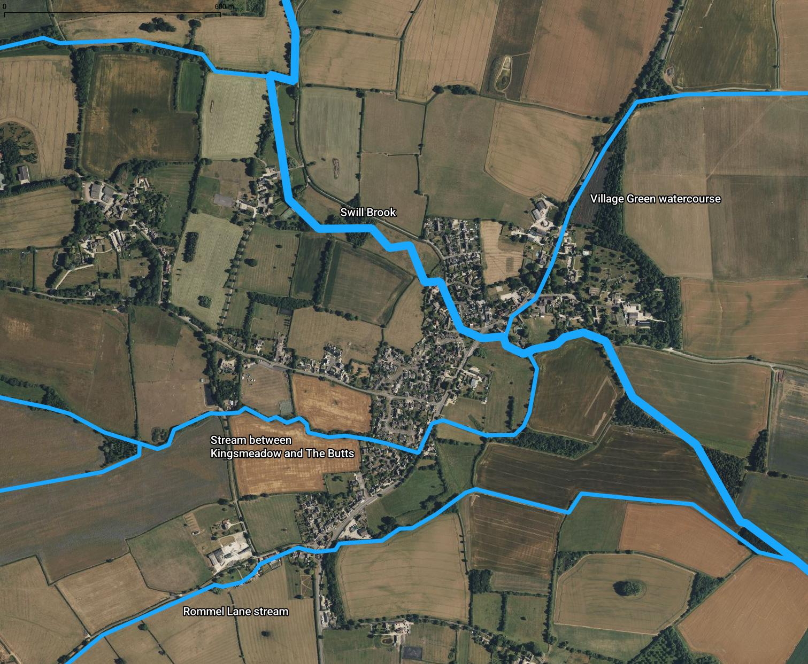
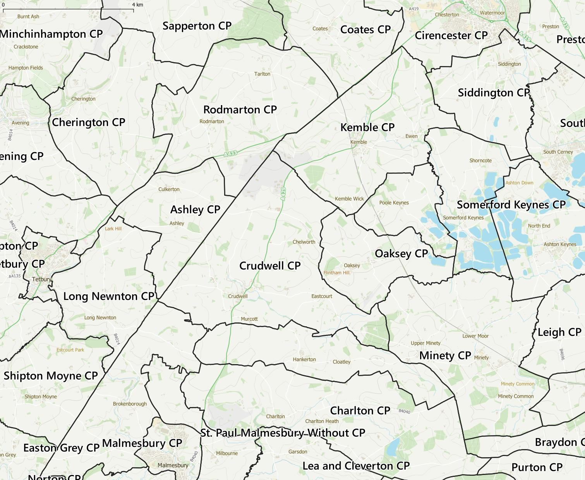
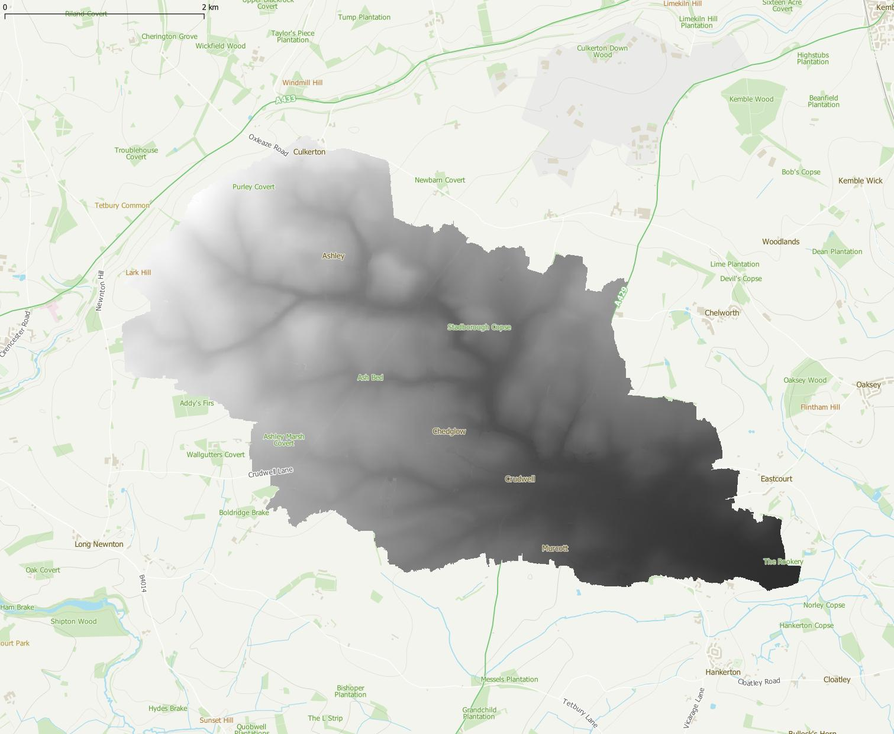
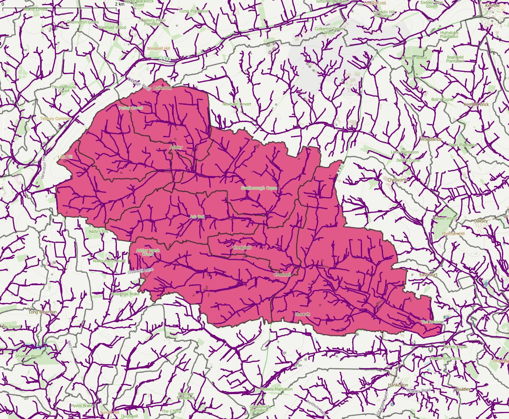

These maps were created by the group and are for educational purposes only.

Satellite imagery © Microsoft Bing Maps.

LIDAR data from the [National LIDAR Programme](https://www.data.gov.uk/dataset/f0db0249-f17b-4036-9e65-309148c97ce4/national-lidar-programme) used under [Open Government License](https://www.nationalarchives.gov.uk/doc/open-government-licence/version/3/) © Environment Agency 2022.

[Overland Flow Pathways](https://environment.data.gov.uk/dataset/36e7f4d3-61b2-4e64-aaa2-2b85bceb61a9) used under [Open Government License](https://www.nationalarchives.gov.uk/doc/open-government-licence/version/3/) © Environment Agency 2023.