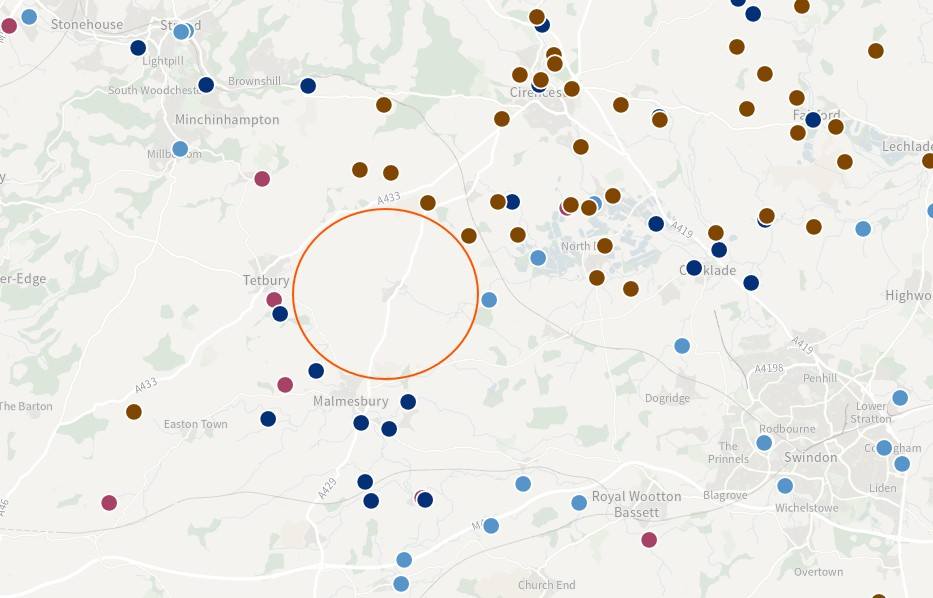
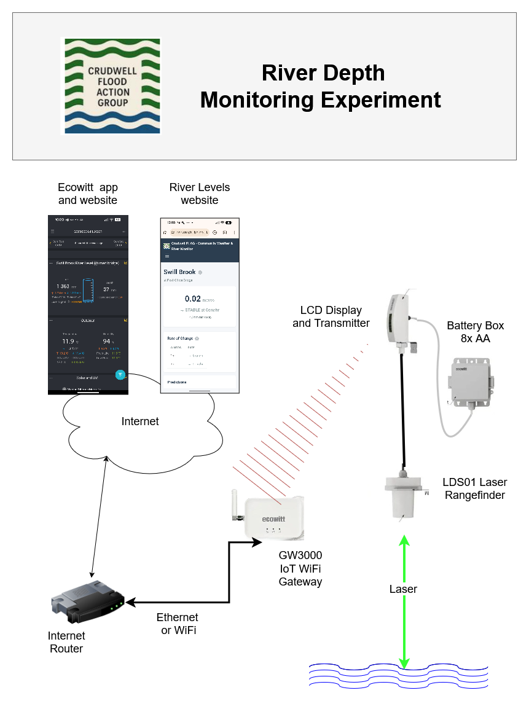

In this part of rural England, there aren't many Environment Agency monitoring stations. Towns and rivers benefit from 24/7 river monitoring, but in and around our Parish there is a lack of infrastructure.

## Gaps in Environment Agency monitoring 

Crudwell is in the centre of this circle, with no local EA monitoring stations.

Not having local monitoring makes it hard to answer questions like this:

1. when should we put flood barriers up?
2. how deep is the river?
3. are floodwaters still rising?

> [!TIP] Although a combination of watching the weather and the EA's regional flood alerts are better than nothing, we think local data and local alerting would give fewer false alarms, resulting in higher confidence.

## Villages need monitoring too

All rural communities benefit from knowing when water levels are rising and when flooding is imminent. The national tools are helpful, but they don't help residents know what's happening right on their doorstep. In our case, the nearest **[river level monitoring station](https://check-for-flooding.service.gov.uk/river-and-sea-levels/crudwell-malmesbury-wiltshire)** is 4km downstream at Oaksey. This is several hours away in terms of water flow! We think more sensors, more local knowledge, and more analytics will give rural communities better answers, and better local alerting.

## Our Rural Internet of Things (RIoT) experiment

We've built and installed a local river level monitor which is off-the-shelf and extremely low cost. This is how it works:

Read more details in [this blog](/blog/weather-and-river-monitoring).

## New River Levels website

We've also built a website called **[riverlevels.org.uk](https://riverlevels.org.uk)** to display depths from multiple sensors in and around our village.

This site can support your community too, so contact us if you are thinking about or already have IoT sensors.
